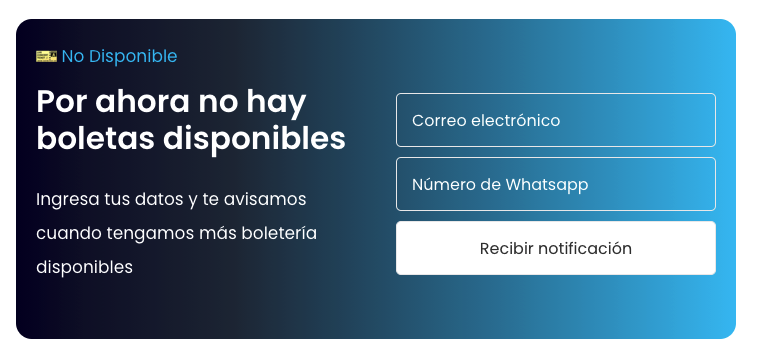

Los banners son fragmentos HTML que deberán insertarse dentro del blog del teatro en cada uno de los artículos que lo requeiran. Al hacerlo se aconseja editarlos en algún editor de texto plano y NO en word u otro editor de texto.

# API
Si alguno de los banners usa algún formaulrio estos datos serán guardados en la base de datos de Sendy en la lista seleccionada.

# Estructura
Los banner se encuentran dentro de un archivo HTML el cual no debe ser copaido en su totalidad. Dentro de cada uno de los archivos encontrarán las instrucciones las lineas de código que se deben copiar

# Sobre el Banner Event
Usa este banner cuando la boletería para alguno de los eventos esté disponible y las personas peudan ir al sitio web del operador de boletería a realziar la compra

## Como cambiar los textos de los banners
Los textos que puedes cambiar siempre los encontrarás entre comillas y si usas un editor de texto plano los verás de un color diferente al resto del código. En el código solo se pdorán cambiar:
* URl del botón de la compra de la boletería
* Textos del banner

# Sobre el Banner Wait List

Usa este banner cuando la boletería esté a la espera de una nueva apertura por aforo o cuando se este considerando hacer una segunda función del mismo evento. Los cambios que podrás hacer son: 
* Textos del banner
* Texto del boton del formulario
* Código de la API (id del formualrio en Sendy)
* Campo del evento al cual se debe asociar el dato

## Cambiar el id de la API

## Cambiar el nombre del evento
Cuando un usuario ingrese sus datos, de forma oculta se enviará el dato sobre el evento en el cual está interesado. Para que esto sucede deberán ingresar en el código el nombre o id del evento al cual esta aosciado el formulario. Para hacerlo deberán unicarse en la linea 125 del código y allí cambiar el texto que está entre comillas por el id o nombre del evento al cual se asociará ese registro del usuario.

## Cambiar texto del botón del formulario
Este cambio se podrá hacer en la linea 142 del código cambiando el texto que está entre comillas. 
